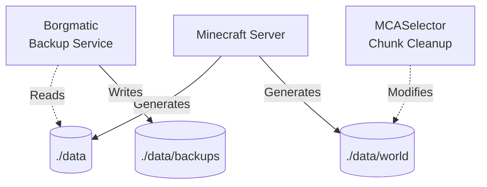

# Architecture

## System Overview



## Components

| Component | Image | Config Location |
|-----------|-------|-----------------|
| Borgmatic | `eclarift/borgmatic:latest` | `./data/config/borgmatic/config.yaml` |
| MCASelector | `eclarift/mcaselector:latest` | `./data/config/mcaselector-options.yaml` |
| Setup | `eclarift/minecraft-setup:latest` | N/A (one-time setup) |
| Shared libs | (mounted volume) | `/opt/shared` |

## Setup Container

The setup container provides version-controlled initialization scripts and templates:

```
setup/
├── Dockerfile
├── scripts/{init.sh}
└── templates/{.env.example}
```

On first run, it extracts scripts to `data/setup-scripts/` and creates default configs in `data/config/`.

## Custom Docker Images

Custom images are built for Borgmatic and MCASelector to include project-specific scripts and templates:

```
modules/borgmatic/
├── Dockerfile
├── scripts/{backup.sh, entrypoint.sh}
└── templates/borgmatic-config.yaml

modules/mcaselector/
├── scripts/entrypoint.sh
└── templates/mcaselector-options.yaml
```
